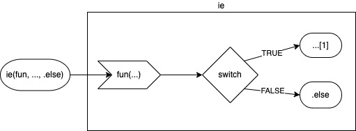

# `ox` short hand if-else.

# 

<!-- badges: start -->
[](https://github.com/gogonzo/ie/actions)
[](https://ci.appveyor.com/project/gogonzo/ie)
[](https://codecov.io/gh/gogonzo/ie/branch/main)
<!-- badges: end -->

### Motivation

Reason to create this package is to simplify the code to check and replace the 
object if it does not satisfy given assumptions. Following code illustrates
typical situation when `x` is checked to return `x` (then) or 
`y` (else).
```r
# basic syntax
if (fun(x)) x else y
```

### Name


### `ox` syntax
`ox` package offers a different syntax for above base R operation, where `x` is 
used once in the call. `x` here is a function argument and "then" value in the
same time.
```r
ox(fun, x, y)
```

`ox` has three arguments: 
- `.f`  a function which returns a single logical value
- `...` named or unnamed arguments to be passed to `.f(...)` to evaluate. First
argument in `...` is considered as a positive-replacement (then) which is 
returned if the `.f` returns `TRUE`. 
- `.else` is a negative-replacement, returned when `.f` returns `FALSE`.



Consider simple example with `base` R and `ox` equivalent.  
```r
x <- "a"
ox(identical, x, "b")
# [1] "a"
```

To invert switching result use `xo`
```r
xo(identical, x, "b")
# [1] "b"
```

Multiple arguments examples
```r
ox(is, "text", "character", .else = "not a character")
# [1] "text"

xo(is, "text", "character", .else = "not a character")
# [1] "not a character"
```

### pipe operators
Syntax is also optimized to use pipe operators. For `magrittr::%>%` it's very 
convenient as one can use `.`. With `|>` one needs to specify `.f = <fun>` and 
`x` will go to the `ox` as first argument.
```r
library(magrittr)
x <- "text"

x %>% ox(is, object = ., "character", "not a character")
# [1] text

x %>% ox(is, ., "character", "not a character")
# [1] text

x %>% ox(.f = is, "character", "not a character")
# [1] text

x |> ox(.f = is, "character", "not a character")
# [1] text
```
