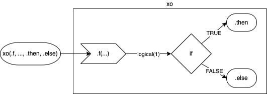
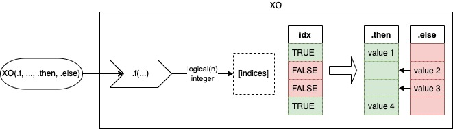

# `ox` short hand if-else.

# 

<!-- badges: start -->

[](https://github.com/gogonzo/ox/actions)
[](https://ci.appveyor.com/project/gogonzo/ox)
[](https://codecov.io/gh/gogonzo/ox/branch/main)

<!-- badges: end -->

### Name

Symbolically, letter "O" and letter "X" represents opposite characteristics. 
Usually, "O" is associated with acceptance while "X" symbolizes rejection. This 
summarizes the meaning of the `ox` which manages switching two values based on 
the TRUE/FALSE condition.

### Motivation

Reason to create this package is to simplify the code to check and
replace the object if it does not satisfy given assumptions. Following
code illustrates typical situation when `x` is checked (possibly against
`y`) to return `x` or `y`.

``` r
# basic syntax
if (is.fun(x)) x else y
if (fun(x, y, ...)) x else y
```

`ox` package offers a different syntax for above base R calls, where `x`
and `y` can be used once in the call to produce the same output.

``` r
ox(fun, x, .else = y)
ox(fun, x, y)
```

### `ox` syntax

`ox` has four arguments:

-   `.f` a function which returns a single logical value.
-   `...` named or unnamed arguments to be passed to `.f(...)` to
    evaluate.
-   `.then` is a positive-replacement, returned when `.f` returns
    `TRUE`. By default, it's the first argument from `...`.
-   `.elselse` is a negative-replacement, returned when `.f` returns
    `FALSE`. By default, it's the last argument from `...`.



Consider simple where `x` checked if it's a character. If condition is
`TRUE` `ox` returns `x` (`.then`) otherwise `.else`. Since `.then` has
not been specified directly `object = x` is considered as a default
value to return when `.f` returns `TRUE`. In this example `x` is a
argument of `.f` and is returned as `.then` in the same time.

``` r
x <- "a"
y <- "b"

ox(.f = is, object = x, class2 = "character", .else = "b")
# [1] "a"
```

Another example illustrates the comparison between two values and return
one matching the condition. In this case `y` is greater than `x` so it's
returned. Both `x` and `y` are used in the function and returned as
`.then` and `.else` in the same time.

``` r
x <- 1
y <- 2

ox(`>`, x, y)
# [1] 2
```

### pipe operators

Syntax is also optimized to use pipe operators. For `magrittr::%>%` it's
very convenient as one can use `.`. With `|>` one needs to specify
`.f = <fun>` and `x` will go to the `ox` as first argument.

``` r
library(magrittr)
x <- 4

x %>% ox(.f = `>`, 5)
# [1] 5

x %>% ox(`>`, ., 5)
# [1] 5

x |> ox(.f = `>`, 5)
# [1] 5
```

## vectorized `OX`



`ox` version for switching vector values instead of switching
single-objects one can use `OX`. `OX` replaces values of the `.then`
with values of `.else` when condition is `FALSE`. `.else` should be a
`atomic` or a `list`. Function `.f` in `OX` can return `logical` vector
or `integer` which determines indices of `.then` to be kept or replaced.

#### 1. Replacing values of `.then` with single value

When `.else` is a vector, the values of `.then` are replaced by the
values of `.else` on the same indices - `.then[!idx] <- .else[!idx]`

``` r
# pick larger values from two vectors
OX(`>`, c(1, 2, 3), c(3, 2, 1))
# [1] 3 2 3
```

When `.else` is a single value, the values of `.then` are replaced by
this value - `.then[!idx] <- .else`

``` r
x <- c(NA, 1, NA)
OX(Negate(is.na), x, .else = 2)
# [1] 2 1 2
```

When `.else` is NULL, the values of `.then` are dropped from the object
- `.then <- .then[idx]`

``` r
# drop values from `.then` is `FALSE`
OX(`>`, c(-1, 0, 1), 0, .else = NULL)
# [1] 1
```

### Inverting the results

Both functions `ox` and `OX` have it's opposite versions - `xo` and
`XO`, which are switching the result of the condition.

``` r
identical(
  ox(Negate(is.na), NA, .else = 1)
  xo(is.na, NA, .else = 1)
)
# [1] TRUE

xo(is.na, NA, .else = 1)
# [1] 1

XO(is.na, c(NA, NA, 2), .else = 1)
# [1] 1 1 2
```
